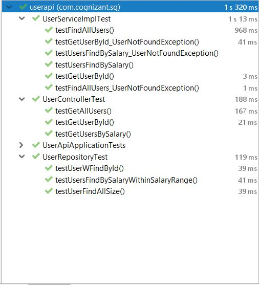

# Technical Challenge (user-api)

Develop a web application with one endpoint, eg GET ​http://localhost:8080/users

## Getting Started

This User API application only provides JSON Response.

### Technologies Used

```
Java 11
Spring Boot 2.2.7.RELEASE
Gradle
```
## Running on machine locally
### Gradle command line
```
git clone https://github.com/paulo-alegre/user-api.git
cd user-api
gradle bootRun
```

## Database configuration
For MySQL database, it is needed to change param "h2db" to "mysql" in string
```
spring.profiles.active=h2db
```

For mysql profile, you need to install MySQL Data(Community Edition). Then create the Users database and check
the application-mysql.properties file for mapping of database values.

### APIs to Test
GET Users API (http://localhost:8080/users)

GET User by Id (http://localhost:8080/users/1)
```json
{
  "name": "John",
  "salary": 2500.05
}
```
GET Users by Salary Range (http://localhost:8080/users/salary?from=0&to=4000)
```json
{
	"results": [{
			"name": "John",
			"salary": 2500.05
		},
		{
			"name": "Mary",
			"salary": 3000
		},
		{
			"name": "Paul",
			"salary": 2577.8
		},
		{
			"name": "Barry",
			"salary": 777
		},
		{
			"name": "Jean",
			"salary": 1357.5
		}
	]
}
```
#### Error Response
GET User by Id Not Found (http://localhost:8080/users/7)
```json
{
  "statusCode": "404",
  "message": "User Id-7 Not Found"
}
```
GET Users by Salary Range Not Found (http://localhost:8080/users/salary?from=5000&to=100000)
```json
{
  "statusCode": "404",
  "message": "No users found in this salary range"
}
```
### Test Results
